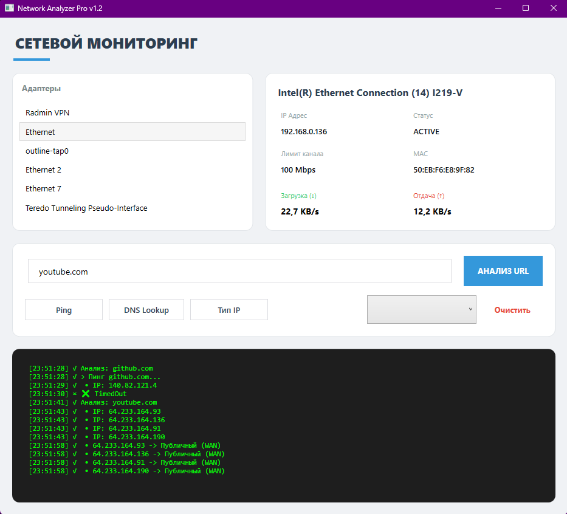
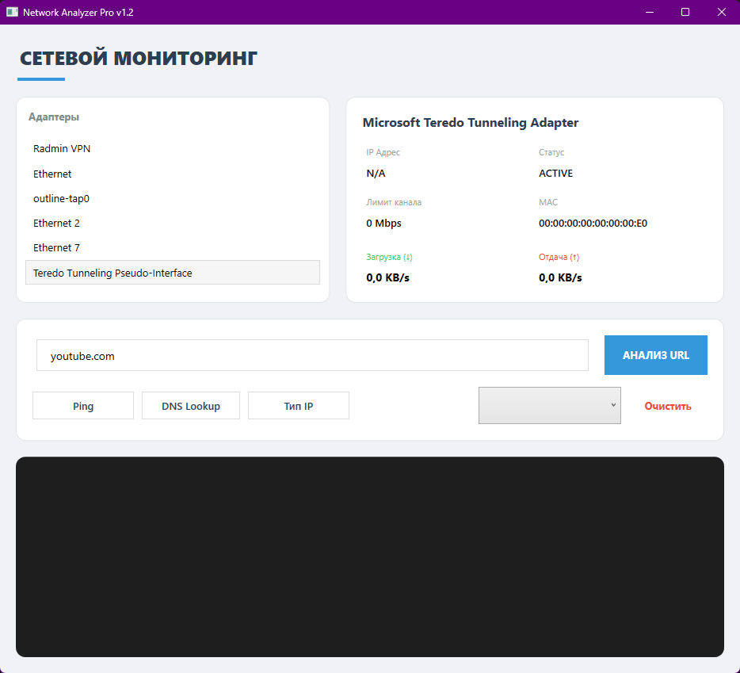

# Network Analyzer

Программное обеспечение для мониторинга сетевых интерфейсов и диагностики сетевых соединений в реальном времени, разработанное на базе .NET WPF.

## Функциональные возможности

* **Мониторинг адаптеров:** Отображение списка всех активных сетевых интерфейсов (Ethernet, Wi-Fi) с детальной информацией (MAC, IP, Статус).
* **Speed Monitor:** Отслеживание входящего (Download) и исходящего (Upload) трафика в реальном времени (KB/s).
* **Сетевая диагностика:**
    * **Ping:** Проверка доступности удаленного узла.
    * **DNS Lookup:** Получение списка IP-адресов по доменному имени.
    * **IP Type:** Определение принадлежности адреса к публичным (WAN) или частным (LAN) сетям.
* **История запросов:** Автоматическое сохранение проанализированных URL в сессионный список для быстрого повторного доступа.
* **Interactive Log:** Консольный вывод всех операций с временными метками.

## Скриншоты программы

## Технологический стек

* **Язык:** C# 
* **Платформа:** .NET 6.0 / .NET Framework 4.8 (WPF)
* **Библиотеки:** `System.Net.NetworkInformation` для работы с трафиком и пингом.
